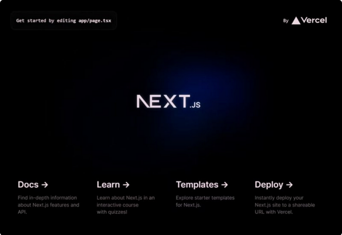

# Nextjs com Docker Ambiente de Produção

## Seguindo Projeto Inicial

> Para criar um aplicativo Next, abra seu terminal, navegue em qualquer pasta desejada e digite:

```
$ npx create-next-app@latest nextjsdockerenvprod
```

>> Opções seguintes selecionadas

```
✔ What is your project named? … nextjsdockerenvprod
✔ Would you like to use TypeScript? … No / Yes
✔ Would you like to use ESLint? … No / Yes
✔ Would you like to use Tailwind CSS? … No / Yes
✔ Would you like to use `src/` directory? … No / Yes
✔ Would you like to use App Router? (recommended) … No / Yes
✔ Would you like to customize the default import alias (@/*)? … No / Yes
```

> Depois, você pode abrir a pasta com o IDE desejado. Execute npm run dev para executar seu aplicativo Next.js.

> E se você visitar localhost:3000, verá o aplicativo Next.js em execução.



## Dockerize o aplicativo Next.js

> Agora podemos encaixar o aplicativo Next.js. Abra o arquivo chamado next.config.js e substitua o conteúdo por este:

```
/** @type {import('next').NextConfig} */
const nextConfig = {
  output: 'standalone'
}

module.exports = nextConfig

```

> .dockerignore: Crie um arquivo chamado .dockerignore e adicione este conteúdo.

```
Dockerfile
.dockerignore
node_modules
npm-debug.log
README.md
.next
.git
```

>> OBS: Isso é necessário para evitar a cópia da pasta node_modules para a imagem do Docker.

## Dockerfile

> Na raiz do projeto, crie um arquivo chamado Dockerfile e adicione este conteúdo:

```
FROM node:18-alpine AS base

# Instale dependências somente quando necessário
FROM base AS deps
# Check https://github.com/nodejs/docker-node/tree/b4117f9333da4138b03a546ec926ef50a31506c3#nodealpine to understand why libc6-compat might be needed.
RUN apk add --no-cache libc6-compat
WORKDIR /app

# Instale dependências com base no gerenciador de pacotes preferido
COPY package.json yarn.lock* package-lock.json* pnpm-lock.yaml* ./
RUN \
  if [ -f yarn.lock ]; then yarn --frozen-lockfile; \
  elif [ -f package-lock.json ]; then npm ci; \
  elif [ -f pnpm-lock.yaml ]; then yarn global add pnpm && pnpm i --frozen-lockfile; \
  else echo "Lockfile not found." && exit 1; \
  fi

# Reconstrua o código-fonte somente quando necessário
FROM base AS builder
WORKDIR /app
COPY --from=deps /app/node_modules ./node_modules
COPY . .

# Next.js coleta dados de telemetria completamente anônimos sobre o uso geral.
# Saiba mais aqui: https://nextjs.org/telemetry
# Remova o comentário da linha a seguir caso queira desabilitar a telemetria durante a construção.
# ENV NEXT_TELEMETRY_DISABLED 1

RUN yarn build

# Se estiver usando npm, comente acima e use abaixo
#EXECUTAR npm executar compilação

# Imagem de produção, copie todos os arquivos e execute em seguida
FROM base AS runner
WORKDIR /app

ENV NODE_ENV production
# Remova o comentário da linha a seguir caso queira desabilitar a telemetria durante o tempo de execução.
# ENV NEXT_TELEMETRY_DISABLED 1

RUN addgroup --system --gid 1001 nodejs
RUN adduser --system --uid 1001 nextjs

COPY --from=builder /app/public ./public

# Defina a permissão correta para o cache de pré-renderização
RUN mkdir .next
RUN chown nextjs:nodejs .next

# Aproveite automaticamente os rastreamentos de saída para reduzir o tamanho da imagem
# https://nextjs.org/docs/advanced-features/output-file-tracing
COPY --from=builder --chown=nextjs:nodejs /app/.next/standalone ./
COPY --from=builder --chown=nextjs:nodejs /app/.next/static ./.next/static

USER nextjs

EXPOSE 3000

ENV PORT 3000
# configura o nome do host como localhost
ENV HOSTNAME "0.0.0.0"

# server.js é criado pela próxima compilação a partir da saída independente
# https://nextjs.org/docs/pages/api-reference/next-config-js/output
CMD ["node", "server.js"]
```
## Composição do Docker

### Execução do Dockerfile

```
$ docker build -t nextjs-docker-env-prod .
$ docker run -d nextjs-docker-env-prod
$ docker run -d -p 3000:3000 nextjs-docker-env-prod
$ docker run -dp 127.0.0.1:3000:3000 nextjs-docker-env-prod
```

> Crie um arquivo chamado docker-compose.yml e adicione este conteúdo

```
version: '3.9'

services:
  nextapp:
    container_name: nextapp
    image: nextapp
    build: .
    ports:
      - "3000:3000"
```

## Construa a imagem Docker e execute o serviço

> Construa a imagem do Docker

```
$ docker compose build
```

> Em seguida, execute os serviços

```
$ docker compose up 
```

> Se você visitar localhost:3000 você verá o aplicativo Next.js em execução (mas desta vez usando Docker)
